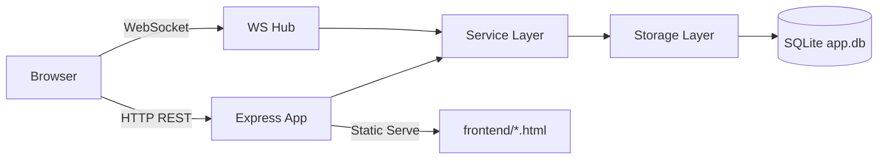

# single_node_service

실시간 커뮤니티 기능(게시글, 댓글, 친구, 1:1 채팅)을 단일 서버에 통합한 서비스입니다.  
`Express + WebSocket + SQLite` 조합으로, 백엔드 1프로세스만 실행하면 프론트엔드까지 함께 서빙됩니다.

## At A Glance

| 항목 | 내용 |
|---|---|
| 실행 모델 | Single Node (단일 프로세스/단일 DB) |
| Backend | Node.js, Express 5, ws, better-sqlite3 |
| Frontend | 정적 HTML/CSS (Vanilla JS) |
| Database | SQLite (`db/app.db`, WAL 모드) |
| 인증 방식 | JWT (REST: Bearer 헤더, WS: query token) |
| 핵심 기능 | 회원가입/이메일인증/로그인, 게시글, 댓글, 친구, 채팅, 실시간 알림 |

---

## Why This Project

이 프로젝트는 아래 목표를 중심으로 구성되어 있습니다.

1. 복잡한 인프라 없이 실시간 기능을 한 번에 검증한다.
2. REST + WebSocket을 함께 다루는 구조를 학습/확장하기 쉽게 만든다.
3. 상태 저장을 SQLite로 단순화해 로컬 개발과 데모 배포를 빠르게 한다.

---

## Core Features

- 이메일 인증 기반 계정 생성
- JWT 기반 로그인/세션 처리
- 게시글 목록/상세 조회, 작성
- 댓글 조회/작성
- 친구 목록, 친구 추가, 읽음 처리
- 1:1 채팅 및 미읽음 카운트 관리
- WebSocket 기반 실시간 반영
  - 새 게시글
  - 새 댓글
  - 새 채팅 메시지
  - 친구 목록 알림

---

## System Architecture



### Runtime Composition

- `backend/src/server.js`
  - HTTP 서버 생성
  - Express 앱 연결
  - WebSocket 서버 연결
- `backend/src/app.js`
  - JSON body parser
  - 정적 파일 서빙(`frontend/`)
  - REST route mount
- `backend/src/modules/websocket.js`
  - WS connection/auth 처리
  - 채널별 broadcast/route 처리

---

## Project Structure

```text
single_node_service/
├─ backend/
│  ├─ .env
│  ├─ package.json
│  └─ src/
│     ├─ server.js
│     ├─ app.js
│     ├─ config/
│     │  ├─ env.js
│     │  └─ mailer.js
│     ├─ modules/
│     │  ├─ auth/
│     │  ├─ post/
│     │  ├─ comment/
│     │  ├─ chat/
│     │  ├─ friend/
│     │  └─ websocket.js
│     └─ storage/
│        ├─ users.storage.js
│        └─ users.token.js
├─ frontend/
│  ├─ index.html
│  ├─ register.html
│  ├─ verified.html
│  ├─ main.html
│  ├─ newpost.html
│  ├─ post.html
│  ├─ friend.html
│  ├─ chat.html
│  └─ css/
└─ db/
   ├─ app.db
   ├─ app.db-wal
   └─ app.db-shm
```

하위 디렉토리별 상세 설명은 각 폴더 `README.md`를 참고하세요.

---

## Quick Start

### 1) Prerequisites

- Node.js 18+ 권장
- Gmail SMTP 계정(앱 비밀번호 포함)

### 2) Environment Variables

`single_node_service/backend/.env`

| 변수명 | 필수 | 설명 | 기본값 |
|---|---|---|---|
| `PORT` | 선택 | 서버 포트 | `3000` |
| `APP_BASE_URL` | 필수 | 인증 링크 생성 기준 URL | 없음 |
| `JWT_SECRET` | 필수 | 로그인 JWT 서명 키 | 없음 |
| `VERIFY_SECRET` | 필수 | 이메일 인증 토큰 서명 키 | 없음 |
| `VERIFY_EXPIRES_MINUTES` | 선택 | 인증 토큰 유효 시간(분) | `30` |
| `MAIL_MODE` | 선택 | 메일 모드 플래그(현재 Gmail 고정) | `ethereal` |
| `MAIL_USER` | 필수 | SMTP 사용자(Gmail) | 없음 |
| `MAIL_PASSWORD` | 필수 | SMTP 비밀번호(앱 비밀번호) | 없음 |

예시:

```env
PORT=3000
APP_BASE_URL=http://localhost:3000
JWT_SECRET=replace_this
VERIFY_SECRET=replace_this_too
VERIFY_EXPIRES_MINUTES=30
MAIL_MODE=ethereal
MAIL_USER=example@gmail.com
MAIL_PASSWORD=gmail_app_password
```

### 3) Run

```bash
cd single_node_service/backend
npm install
node src/server.js
```

접속:

- `http://localhost:3000`

---

## User Flow

1. `register.html`에서 회원가입 요청
2. 이메일 인증 링크 클릭 (`GET /auth/verify?token=...`)
3. `index.html`에서 로그인
4. `main.html`에서 게시글 목록 조회 + 실시간 신규 글 수신
5. 게시글 상세(`post.html`)에서 댓글 조회/작성 + 실시간 댓글 수신
6. 친구(`friend.html`)에서 친구 추가/목록 확인
7. 채팅(`chat.html`)에서 1:1 메시지 송수신

클라이언트는 `localStorage`에 아래 키를 사용합니다.

- `token`
- `name`
- `email`

---

## REST API

인증이 필요한 API는 `Authorization: Bearer <token>` 헤더가 필요합니다.

### Auth

| Method | Path | 인증 | 설명 |
|---|---|---|---|
| `POST` | `/auth/register` | 아니오 | 회원가입 + 인증 메일 전송 |
| `GET` | `/auth/verify?token=...` | 아니오 | 이메일 인증 처리 후 `verified.html`로 리다이렉트 |
| `POST` | `/auth/login` | 아니오 | 로그인(JWT 발급) |

### Post

| Method | Path | 인증 | 설명 |
|---|---|---|---|
| `GET` | `/post/getposts` | 예 | 게시글 목록 조회 |
| `GET` | `/post/getpost/:id` | 예 | 게시글 상세 조회 |
| `POST` | `/post/addpost` | 예 | 게시글 작성(HTTP fallback) |

### Comment

| Method | Path | 인증 | 설명 |
|---|---|---|---|
| `GET` | `/comment/getcomment/:id` | 예 | 댓글 목록 조회 |
| `POST` | `/comment/addcomment/:id` | 예 | 댓글 작성(HTTP fallback) |

### Chat / Friend

| Method | Path | 인증 | 설명 |
|---|---|---|---|
| `GET` | `/chat/messages/:targetName` | 예 | 특정 사용자와의 채팅 내역 조회 |
| `GET` | `/friend/list` | 예 | 친구 목록/미읽음 조회 |
| `POST` | `/friend/read/:friendName` | 예 | 읽음 처리 |
| `POST` | `/friend/add/:targetName` | 예 | 친구 추가 |

---

## WebSocket Contracts

연결 URL 형식:

- `ws://<host>/ws/post?token=<jwt>`
- `ws://<host>/ws/cmt?token=<jwt>`
- `ws://<host>/ws/chat?token=<jwt>`
- `ws://<host>/ws/friend?token=<jwt>`

인증 실패 close code:

- `4001` JWT 만료
- `1008` 인증 실패 또는 알 수 없는 path

### Channel Summary

| Channel | Client -> Server | Server -> Client |
|---|---|---|
| `/ws/post` | `{ "title", "text" }` | `{ "name", "title", "id" }` |
| `/ws/cmt` | `{ "id", "text" }` | `{ "postId", "name", "text", "time" }` |
| `/ws/chat` | `{ "targetName", "text" }` | `{ "from", "to", "text", "time", "read" }` |
| `/ws/friend` | (없음, 수신 전용) | `{ "type": "new_message", "from": "..." }` |

---

## Data Model (SQLite)

핵심 테이블:

| Table | 역할 |
|---|---|
| `users` | 계정, 해시 비밀번호, 인증 상태 |
| `posts` | 게시글 |
| `comments` | 게시글별 댓글 |
| `chat_rooms` | 1:1 채팅방 |
| `chat_messages` | 채팅 메시지(읽음 포함) |
| `friends` | 친구 인덱스, 최근 메시지 시간, 미읽음 카운트 |

설계 포인트:

- DB 파일: `db/app.db`
- WAL 모드 사용: `app.db-wal`, `app.db-shm` 생성
- `comments.post_id`는 `posts.id`를 FK 참조(`ON DELETE CASCADE`)
- 채팅 메시지 저장과 친구 인덱스 갱신은 트랜잭션으로 처리
- room id 생성 규칙: 사용자명 정렬 후 `userA_userB`

---

## Security Model

- 로그인 성공 시 JWT 발급 (`expiresIn: 1h`)
- REST는 Bearer 토큰 검증
- WS는 query token 검증
- 비밀번호는 bcrypt hash 저장
- 이메일 인증 완료 전 로그인 차단

---

## Operations & Troubleshooting

### 서버가 시작 직후 종료되는 경우

- `MAIL_USER`, `MAIL_PASSWORD` 누락 여부 확인
- Gmail 앱 비밀번호 설정 상태 확인
- `backend/src/config/mailer.js`에서 SMTP verify 실패 시 프로세스 종료

### 포트 충돌

- 기본 포트는 `3000`
- 다른 서비스와 동시 실행 시 `PORT` 변경 필요

### DB 파일 취급

- `db/app.db-wal`, `db/app.db-shm`은 정상 런타임 파일
- 서버 실행 중 DB 파일 수동 편집/삭제 금지

---

## Known Caveat (현재 코드 기준)

일부 에러 문자열이 controller의 분기 문자열과 완전히 일치하지 않아,  
특정 실패 케이스가 의도한 4xx 대신 500으로 응답될 수 있습니다.

예:

- `INVALID TOKEN` vs `INVALID_TOKEN`
- `INVALID CREDENTIALS` vs `INVALID_CREDENTIALS`

---

## Related Docs

- `backend/README.md`
- `backend/src/README.md`
- `backend/src/modules/README.md`
- `frontend/README.md`
- `db/README.md`

